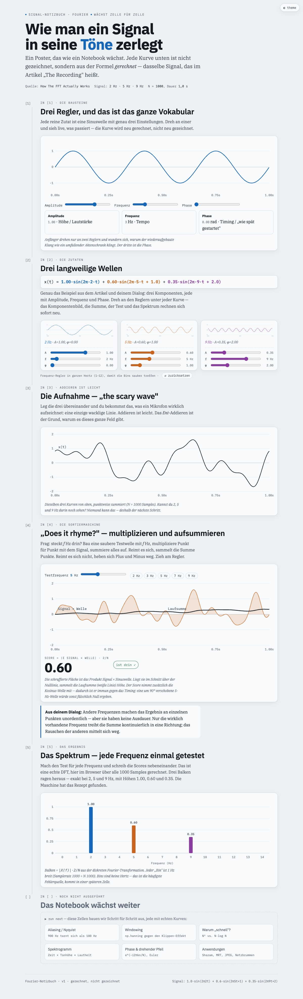

# Fourier — ein Poster, das wie ein Notebook wächst

Ein visuelles Poster, das die Fourier-Transformation erklärt und **Schritt für Schritt wächst**,
ein bisschen wie ein Jupyter-Notebook: jede Erklärstufe ist eine „Zelle". Grundlage sind der
Medium-Artikel *„How The Fast Fourier Transform Actually Works"* und der begleitende NotebookLM-Dialog.

**Alle Kurven sind echt** — nicht gezeichnet, sondern zur Laufzeit aus der Signalformel gerechnet
(bis hin zu einer echten DFT im Browser).

## Live ansehen

**→ https://tillg.github.io/fourier/** (GitHub Pages, ohne Login, direkt im Browser)



> Interaktiv: alle Komponenten-Regler, die Testfrequenz und der Theme-Umschalter sind bedienbar.
> (Auch als Claude-Artifact: https://claude.ai/code/artifact/877d1135-2b0c-487a-87db-3b38f9498e85)

## Das Signal

```
x(t) = 1.00·sin(2π·2·t) + 0.60·sin(2π·5·t + 1.0) + 0.35·sin(2π·9·t + 2.0)
```
Sample-Rate 1000 Hz, Dauer 1,0 s, N = 1000 — exakt das Beispiel aus Artikel und Dialog.

## Zellen (v1)

1. **Drei Regler** — Amplitude / Frequenz / Phase, an einer echten Sinuskurve, interaktiv.
2. **Drei Komponenten** — 2 Hz, 5 Hz, 9 Hz als echte Kurven, **je mit eigenen A/f/φ-Reglern**. Änderungen wirken sofort auf Komponente, Summe, Test und Spektrum.
3. **Die Aufnahme** — die Summe („scary wave"), auto-skaliert.
4. **„Does it rhyme?"** — Signal × Testwelle, schraffierte Produktfläche, Laufsumme, Score (phasen-immun via sin+cos). Interaktiver Frequenz-Regler.
5. **Das Spektrum** — echte DFT im Browser; Peaks bei 2/5/9 Hz mit Höhen 1.00 / 0.60 / 0.35.

**Wächst weiter** (noch leere Zellen): Aliasing/Nyquist, Windowing, „warum schnell" (N² vs. N·log N),
Spektrogramm, Phase & drehender Pfeil, Anwendungen (Shazam, MRT, JPEG, Netzbrummen).

## Lokal ansehen

```bash
python3 -m http.server 8747   # dann http://localhost:8747/ öffnen
```

## Hinweise

- Repo ist **public** und wird über **GitHub Pages** aus `index.html` (Branch `main`, Root)
  ausgeliefert: https://tillg.github.io/fourier/ — ohne Login im Browser sichtbar.
- Die Quell-PDF (34 MB) liegt lokal, ist aber bewusst **nicht** eingecheckt (Größe + Urheberrecht).
- Entscheidungen & Annahmen: siehe [`DECISIONS.md`](DECISIONS.md).
